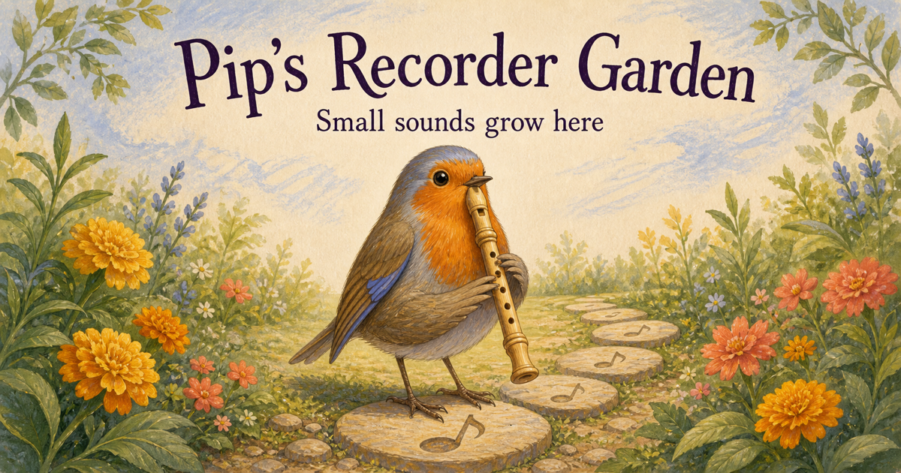

# Pip’s Recorder Garden



Pip’s Recorder Garden is a static, interactive course for a young beginner playing a soprano or descant recorder in C with Baroque fingering. It has twelve open lessons. Each one is a short musical mission: hear the whole pattern, copy it in a way that suits today, make a tiny tune or finish without one, then stop or replay by choice.

The microphone is a helper, not a judge. It estimates one note at a time, can be confused by rooms and devices, and never grades tone quality or the child. Fingering puzzles, rhythm taps and grown-up co-play make every lesson usable without microphone permission.

The interface has two separately mounted views. The grown-up view owns lesson choice, teaching detail, privacy and the full guided mission. **Start child play** opens one full-screen task with Pip, the note letters A to G, Play, Stop, Try, Done and Back. Its actions are at least 64 by 64 CSS pixels, and the task does not scroll at the checked phone and tablet sizes, in a short landscape view or with text enlarged to 200%. The child view receives no lesson prose or open error string. It currently models the chosen pattern, then returns to the grown-up view for the remaining mission controls.

## Run it locally

Use Node 22.19 or newer.

### Development server

```sh
npm ci
npm run dev
```

Open the exact localhost URL Vite prints. `localhost` is a secure browser context, so the microphone can work there. Opening `index.html` directly from disk is not supported.

### Production-like preview

```sh
npm run verify:local
npm run preview
```

The build goes to `dist/` and uses relative asset paths, so it works under a GitHub Pages repository subpath.

## Play a lesson

1. In the grown-up view, choose any lesson on the garden path. Nothing is locked. Use **Start child play** for the large one-screen model card, or keep the detailed controls open for supported practice.
2. Press **Hear the whole pattern**. The note stones move with every note and beat; sound never starts by itself.
3. Copy in one of four ways: play to Pip, build the fingering picture, tap the rhythm, or echo with a grown-up. Only the first route asks for microphone permission.
4. Make a two-to-four-note tune from the notes in that lesson, or choose **Finish without a tune**. Hear, stop and change a tune as often as you like; either route records participation, not mastery.
5. Finish the turn. Choose **Stop here for today**, **Play this mission again** or **Back to the garden path**. The site never moves to the next lesson by itself.

Guide playback and the microphone cannot run together. Starting either one stops the other first. Opening or leaving child play also stops both owners before changing views. Guide playback stops after the pattern, on lesson change, when the tab is hidden and when the lesson is completed.

## The twelve lessons

| # | Lesson | Main step | Level |
|---:|---|---|---:|
| 1 | Meet B | one steady B | 1 |
| 2 | B twice | repeat B with a real release | 1 |
| 3 | Meet A | add the second left-hand finger | 1 |
| 4 | B and A seesaw | change one finger | 2 |
| 5 | Meet G | add the third left-hand finger | 2 |
| 6 | Garden steps | B, A, G, A, B | 2 |
| 7 | B rhythm | three articulated Bs | 3 |
| 8 | Two-note echo | copy B and A | 3 |
| 9 | Three-note echo | copy B, A and G | 3 |
| 10 | Raindrop Walk | first original tune | 4 |
| 11 | Morning Robin | second original tune | 4 |
| 12 | C to C | explore the complete natural octave | 5 |

The optional sequence helper checks pitch order and stable notes. The rhythm activity compares only the broad timing shape of taps. Neither pretends to grade articulation, breath, posture, expression or learning.

## Microphone and saved-data boundary

Once its static files have loaded, the child-facing application has no network request, audio recorder, analytics, account, camera, IndexedDB, socket, beacon or service worker. Microphone samples pass from a `MediaStreamAudioSourceNode` to an `AnalyserNode`, then into the pitch detector in browser memory. The microphone graph is never connected to the speakers.

The only saved value is a sorted set of completed lesson IDs in `localStorage`. There is no name, raw audio, made tune, tap timing, chosen route, attempt count, detected frequency history, score, streak, timestamp or permission state. **Forget saved progress** clears it from that browser.

GitHub Pages serves over HTTPS, which allows browsers to offer microphone permission. Permission remains a browser and device decision; the site still works with diagrams, guide tones and adult-assisted completion when access is denied.

## Check a real device before handing it to a child

The synthetic tests establish detector behaviour, not hardware behaviour. Her father should make this short acceptance pass on each intended browser:

- on the intended phone and tablet, open child play in portrait and landscape, enlarge text if the device offers that setting, and confirm the card stays still while both actions remain comfortable to tap;
- open lesson 8, press **Hear the whole pattern**, and confirm B, A, A, B sounds once with the matching note stones pulsing;
- stop the lesson pattern part-way through and confirm sound stops at once;
- make a two-to-four-note tune, confirm note choices freeze while it sounds, then use **Stop my tune**;
- open lesson 1 and confirm the permission prompt appears only after choosing **Play to Pip** and pressing **Let Pip listen**;
- play B at a comfortable distance and confirm quiet, uncertain and matched states make sense in that room;
- press **Stop listening** and confirm the browser’s live-microphone indicator clears;
- start listening again, switch lesson, then hide the tab and confirm the indicator clears both times;
- deny permission once and complete a turn through rhythm, fingering or grown-up co-play;
- play a guide pattern and confirm the site is not listening at the same time;
- finish a turn and confirm the choices are stop, replay and garden, with no automatic progression;
- keep device volume conversational and take a break whenever the child wants one.

## Add an idea

`LESSON_IDEAS.md` is the editable inbox at the repository root. Add one unique unchecked line under **Inbox**:

```text
- [ ] idea-013: Explore high C after a gentle B and show both fingerings.
```

The agent selects at most three pending ideas. It receives the idea text as delimited, untrusted data and may return only closed-schema lesson objects. The deterministic code then checks identifiers, order, difficulty, note vocabulary, text length, plain-text safety and the complete catalogue. The only permitted repository changes are new `content/lessons/NNN-name.json` files and the matching inbox checkboxes.

Fixture mode proves this boundary without calling a model or writing files:

```sh
npm run agent:propose -- --dry-run \
  --inbox tests/fixtures/pending-ideas.md \
  --fixture tests/fixtures/agent-response.json \
  --max 1
```

## Choose an agent provider

The adapter speaks two live provider protocols:

- `openai-compatible` for services exposing `/chat/completions`, including a local Ollama/Qwen or Shoggoth-compatible endpoint;
- `anthropic` for Claude through the Anthropic Messages API.

GitHub Models is intentionally absent: GitHub retired its playground, catalogue and inference API on 30 July 2026.

### Local OpenAI-compatible service

```sh
export LESSON_AGENT_PROVIDER=openai-compatible
export LESSON_AGENT_MODEL=qwen-model-name
export LESSON_AGENT_BASE_URL=http://127.0.0.1:11434/v1
npm run agent:propose -- --dry-run
```

Remote endpoints must use HTTPS and need `LESSON_AGENT_API_KEY`. Loopback HTTP is allowed for a local or self-hosted runner and nowhere else.

### Anthropic

```sh
export LESSON_AGENT_PROVIDER=anthropic
export LESSON_AGENT_MODEL=claude-model-name
export LESSON_AGENT_API_KEY=your-secret
npm run agent:propose -- --dry-run
```

Do not run the write mode on `main`. Use a branch, review the resulting lesson copy, then run `npm run check` before opening a pull request.

## Scheduled proposal pull requests

`.github/workflows/agent-lessons.yml` runs at 04:37 UTC on Mondays and can be started manually. The odd minute reduces exposure to the start-of-hour Actions queue. A schedule is best-effort: GitHub may delay or drop a run, it uses the current default-branch commit, and public-repository schedules are disabled after 60 days without repository activity.

Set repository variables:

- `LESSON_AGENT_PROVIDER`: `openai-compatible` or `anthropic`;
- `LESSON_AGENT_MODEL`: the provider’s exact model identifier;
- `LESSON_AGENT_BASE_URL`: required for OpenAI-compatible endpoints;
- `LESSON_AGENT_RUNNER`: optional single runner label such as `self-hosted`.

Set `LESSON_AGENT_API_KEY` as an Actions secret for a remote provider. A GitHub-hosted runner cannot reach Ollama on a family computer; use a self-hosted runner for a loopback service.

The provider endpoint comes only from the reviewed repository variable. Manual dispatch can choose a provider and model, but cannot redirect the API credential to another URL.

The workflow needs permission to create a proposal branch and pull request. `LESSON_PR_TOKEN` is an optional secret for a dedicated fine-grained token with repository contents and pull-request write access. Without it, the workflow falls back to `GITHUB_TOKEN`, and the repository setting that permits Actions to create pull requests must be enabled. Events created by `GITHUB_TOKEN` do not recursively start other workflows, so the proposal job runs the full local check itself. A human still reviews and merges; there is no auto-merge path.

## Publish with GitHub Pages

The intended live site is [laurenceday.github.io/pip-recorder-garden](https://laurenceday.github.io/pip-recorder-garden/). The repository contains a GitHub Actions Pages workflow, but the live Pages source was still the legacy branch publisher when this child-first run began. That publisher overwrote the built artifact with an entry that referenced `/src/main.tsx`. Do not treat the public URL as ready until the separately authorised Pages setting change and the built-asset check both pass.

`.github/workflows/pages.yml` verifies the accepted `main` tree, uploads only `dist/`, and gives deployment permissions only to the deploy job. To enable the same setup in a fork or replacement repository:

1. Open **Settings → Pages**.
2. Choose **GitHub Actions** as the source.
3. If the repository policy requires it, protect the `github-pages` environment so only `main` may deploy.
4. Merge a reviewed pull request into `main`, or run the workflow manually from the accepted `main` commit.

The first live deployment built and checked main commit `9cf6f60a69aeebaafdf8191e7f04c902e7014e2d` before publishing its `dist/` artifact.

## Verification

```sh
npm run check          # catalogue, tests, TypeScript, lint, static boundaries
npm run test:report    # receipted TAP result in .elenchus/node-test.json
npm run verify:local   # check, production build and dependency audit
node scripts/check-child-copy.mjs --candidate one-screen-play-loop --criterion rendered-child-copy-approved --report .hexaemeron/reports/conformance/one-screen-play-loop--rendered-child-copy-approved.json
node scripts/check-child-layout.mjs --candidate one-screen-play-loop --criterion small-phone-no-scroll --report .hexaemeron/reports/conformance/one-screen-play-loop--small-phone-no-scroll.json
```

The mission tests cover the complete lesson 8 B-A-A-B schedule, beat lengths, repeated-note gaps, explicit stop states, broad rhythm matching and lesson-bounded two-to-four-note tunes. The pitch fixtures cover C5 through C6 with harmonics, silence, broadband noise, adjacent-note refusal, stable holds and repeated-note releases. The static boundary fails if child-facing source gains a recorder or outbound channel, if microphone access or local storage escapes its one named module, or if the microphone graph reaches audible output. A second check inspects the minified production JavaScript after Vite builds it and refuses recorder or outbound-network APIs there too.

The child-copy check binds every declared child state to a deterministic manifest, admits only the reviewed 13-token lexicon and checks that `App` mounts either the child tree or the grown-up tree. It follows imported child TSX, checks global CSS for generated copy, binds its own checker, dependency lock and every inspected render byte to the reported commit, and refuses open visible or accessible expressions, dynamic error text, opposite-role imports and undeclared states. It records the Node and TypeScript versions and writes only through checked, non-symlink report paths. This is a repository copy rule, not proof that one child can read every admitted word.

The child-layout check launches the built app in a bounded local Chrome process. It replays ready, playing, done and error at 320 by 568, 391 by 844 and 768 by 1024 CSS pixels, plus 568 by 320 landscape and 320 by 568 with 200% text and reduced motion. It rejects document or horizontal overflow, text below 20 CSS pixels, actions below 64 by 64 CSS pixels, clipped actions, a missing exit or focus left outside child play.

## How the design was chosen

The study followed a fixed path:

1. Translate the request into observable acceptance tests and explicit non-goals.
2. Check primary sources for Baroque fingerings, beginner technique, early-years teaching, browser capture, pitch detection, accessibility and Pages operation.
3. Record disagreements and gaps instead of inventing certainty. B, A and G is a common starting sequence, not a universal one; no authoritative source fixes one ideal lesson length for every five-year-old.
4. Compare designs against the hard boundaries: twelve lessons, local audio, microphone fallback, schema-bound extension and human review before publication.
5. Build the risky pure parts first, using synthesized audio and hostile model fixtures, before adding permission or interface code.
6. Keep publication, Pages settings and real-device claims separate from a green local build.

The receipted studies, runbooks and current corrections live under `docs/research/`. [ADR-004](docs/decisions/ADR-004-guided-mission-loop.md) records why every lesson now uses one guided mission instead of a mini-game arcade or an unguided composition screen.

## Primary sources

- [Yamaha Baroque soprano fingering chart](https://www.yamaha.com/en/musical_instrument_guide/common/images/recorder/fingering_baroque.pdf)
- [American Recorder Society soprano fingering chart](https://americanrecorder.org/docs/Fingering_Chart_for_Soprano_Recorder.pdf)
- [Yamaha: Baroque and German fingering](https://www.yamaha.com/en/musical_instrument_guide/recorder/selection/selection002.html)
- [Department for Education: Development Matters](https://www.gov.uk/government/publications/development-matters--2/development-matters)
- [W3C: Media Capture and Streams](https://www.w3.org/TR/mediacapture-streams/)
- [W3C: Web Audio API](https://www.w3.org/TR/webaudio-1.0/)
- [YIN pitch-estimation paper](https://pubmed.ncbi.nlm.nih.gov/12002874/)
- [W3C: WCAG 2.2](https://www.w3.org/TR/WCAG22/)
- [GitHub: custom workflows for Pages](https://docs.github.com/en/pages/getting-started-with-github-pages/using-custom-workflows-with-github-pages)
- [GitHub: workflow schedule behaviour](https://docs.github.com/en/actions/reference/workflows-and-actions/events-that-trigger-workflows#schedule)
- [GitHub: Models retirement](https://docs.github.com/en/github-models)
